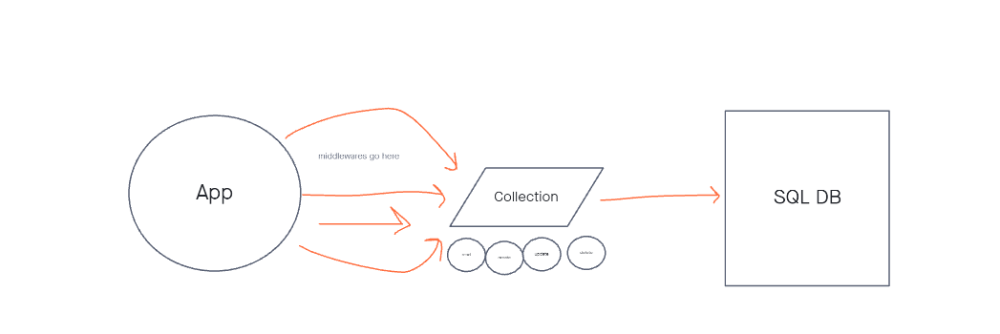

# api-server

## Live Deploy
[Heroku](https://alfredo-api-server.herokuapp.com/)

## Deployment

Your server must be deployed at Heroku.
If it requires a database, provision it.
For APIs, your endpoints should all be testable remotely using an HTTP REST client.
For Web Servers, your website must be reachable.

How do I install the app or library? Clone this app and install all dependencies.

How do I test the app or library? Run "NPM test" in the terminal once all dependencies are installed.

For Applications: How do I run the app? Run nodemon or node (whatever file you have the start in. In my case it is index.js) How do I set up the app? I set up the app with Heroku

## Testing
[TESTS](./__tests__)

## Documentation

## Contributions
Jordan Yamada - Helped a lot with the understanding, and the process of making or finishing this Lab
Jeffrey Smith - Helped a lot with starting the Lab. He also explained with understanding the basics of the whole express and SQL better.
